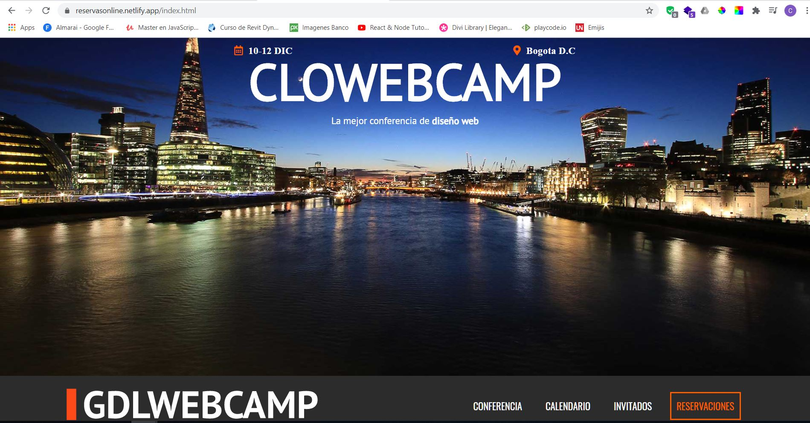

    <h1>RESERVACIONES ONLINE PARA EVENTOS DE DESARROLLO</h1>
    

        Este desarrollo es netamente Frontend. Se realizo sin Framework, tan solo con HTML, CSS3 y JavaScript.
    

    </img>

Mira la Demo: <a href="https://reservasonline.netlify.app/index.html">Reservas demo</a>   

